# Todo List Application

This is a simple Todo List application built using React, TypeScript, Vite, and Material UI. It allows users to add, edit, delete, and filter their tasks. The app also includes user authentication features using React Context and local storage.

## Getting Started

Follow the instructions below to run the application locally on your machine.

### Prerequisites

Before you begin, make sure you have the following tools installed:

- [Node.js](https://nodejs.org/) (version 14 or later)
- [npm](https://www.npmjs.com/) or [yarn](https://yarnpkg.com/)

### Installation

1. **Clone the repository**:

   ```bash
   git clone https://github.com/Warna97/Todo-app.git
   cd todo-app
    ```

2. **Install dependencies**:

   If you're using npm:

   ```bash
   npm install
   ```

   Or if you're using yarn:

   ```bash
   yarn install
   ```

3. **Run the development server**:

   For npm:

   ```bash
   npm run dev
   ```

   For yarn:

   ```bash
   yarn dev
   ```

4. **Access the application**:

   Open your browser and go to `http://localhost:5173` to view the application.

### Build for Production

To create a production build, run the following command:

For npm:

```bash
npm run build
```

For yarn:

```bash
yarn build
```

### Linting

The project is set up with ESLint for code linting. Run the following command to check for linting issues:

For npm:

```bash
npm run lint
```

For yarn:

```bash
yarn lint
```

## Task Summary

- **Todo List Feature**: Users can add, edit, delete, and mark tasks as complete.
- **User Authentication**: Implemented using React Context and local storage. Users can sign up, log in, and log out.
- **Task Popup**: Task creation and editing are done through modals for a better user experience.
- **Task Filtering**: Added a filtering section to display "All," "Todo," and "Completed" tasks with the corresponding counts.
- **React Context for Authentication**: Managed authentication and user state with React Context.
- **Material UI**: Used Material UI components to ensure a consistent and easy-to-use interface.
- **Persistent State**: Todos and authentication states are stored in local storage to maintain data between sessions.
- **Built with Vite, React, and TypeScript**: Vite was chosen for fast build times, and React with TypeScript provided static type checking.
- **Minimal Third-Party Libraries**: Limited use of third-party libraries to keep the project lightweight.
- **ESLint**: Ensured code quality with linting.

## Screenshots

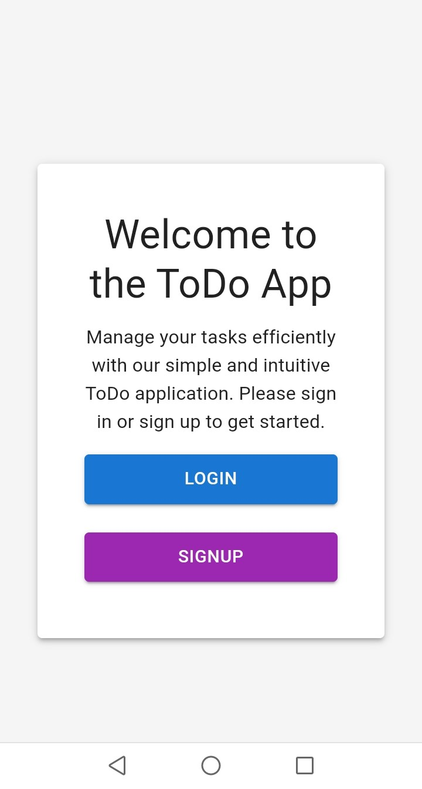
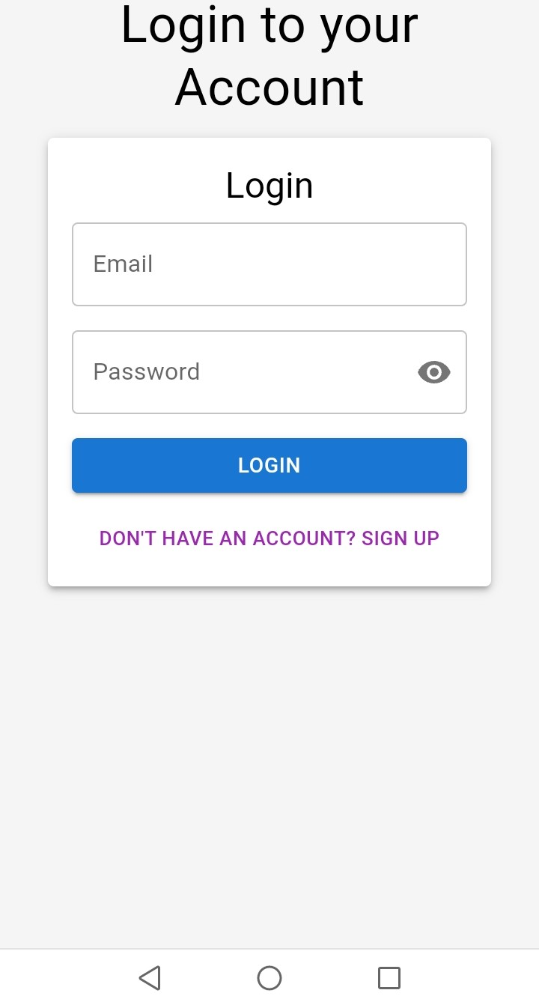
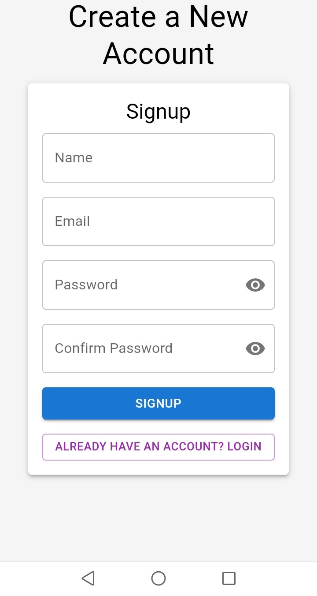
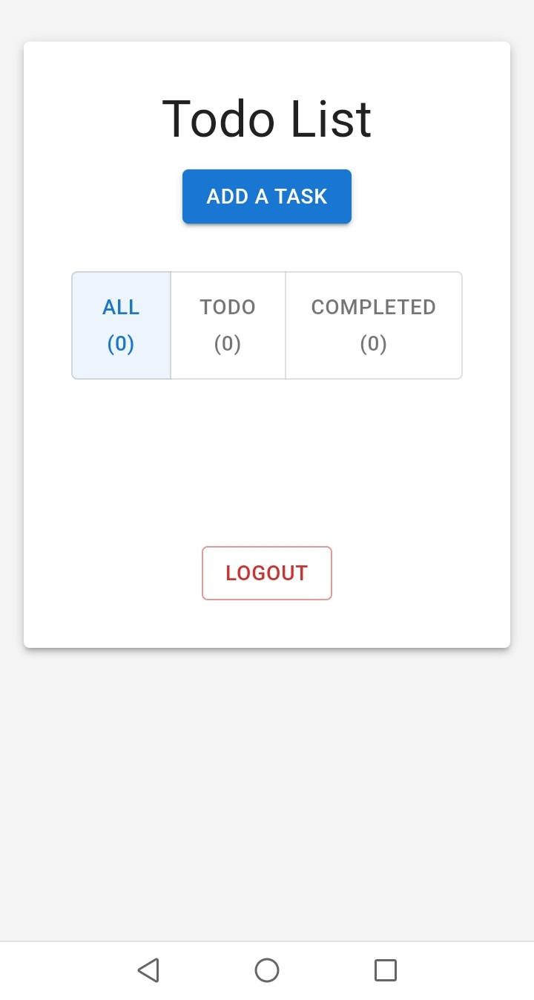

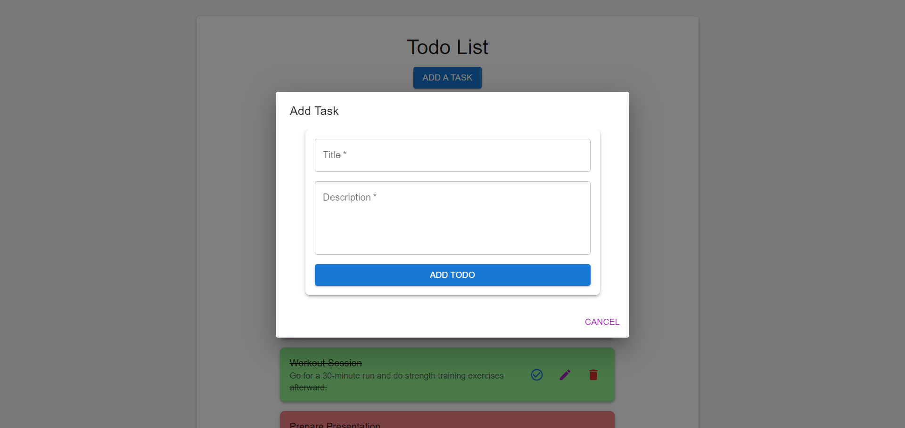
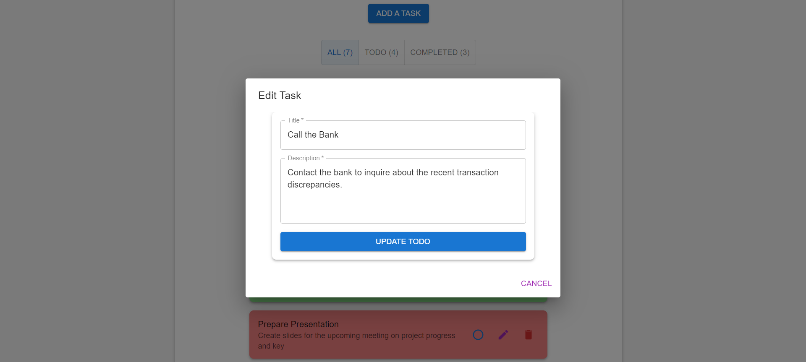
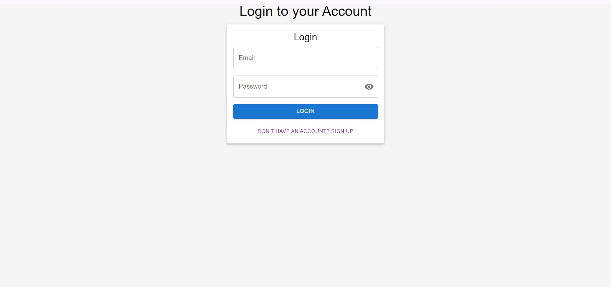
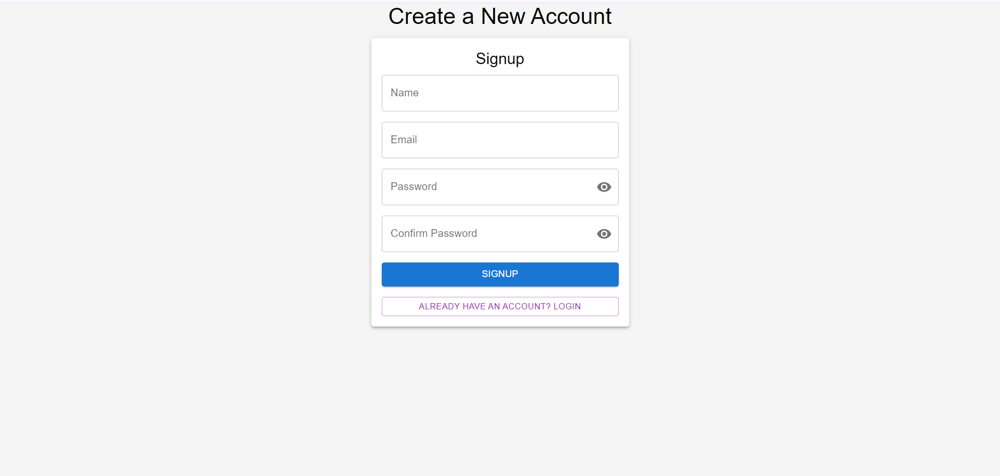
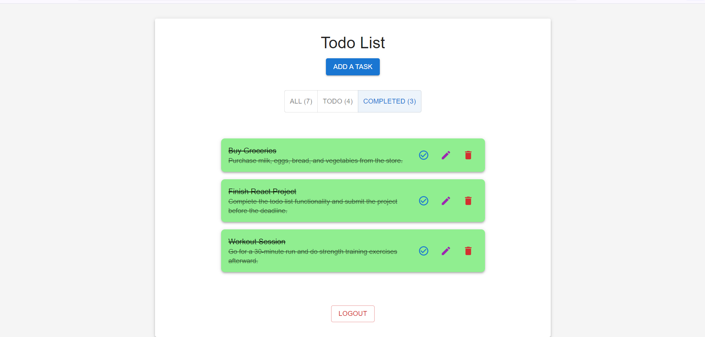
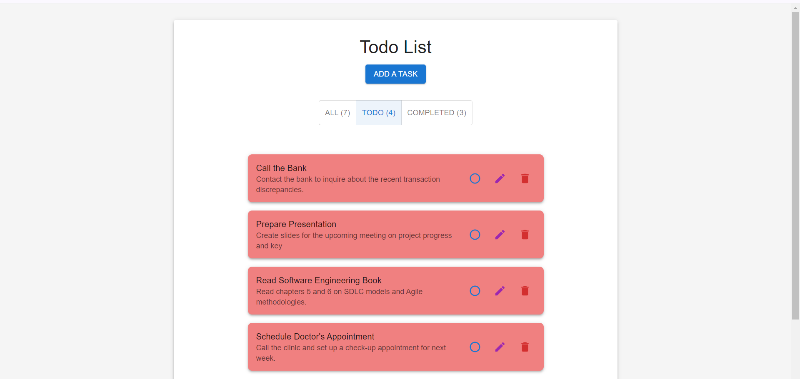
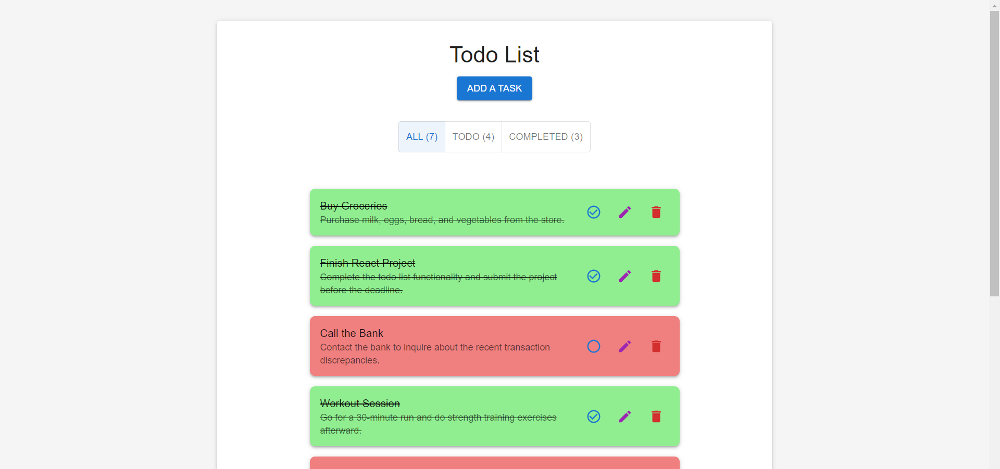
